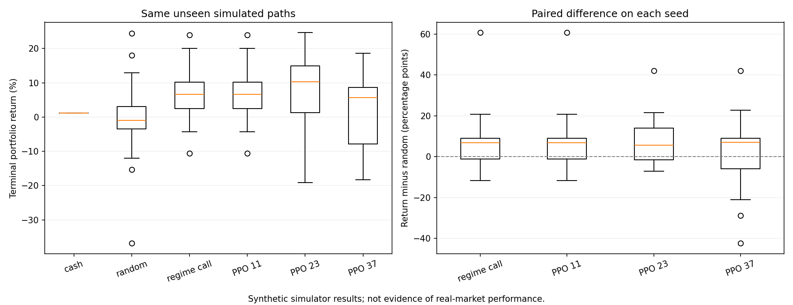

# Options RL: a simulated options-trading environment

This is an educational reinforcement-learning project, not a live trading system or evidence of a profitable strategy. It combines a Black–Scholes–Merton (BSM) pricing engine, a Gymnasium environment, and a PPO agent. Market paths and option quotes are generated by the simulator; no historical market data is used.

## What is implemented

- `bsm.py`: European call/put pricing, autograd Greeks, Newton–Raphson implied-volatility inversion.
- `env.py`: one simulated underlying, one call and one put, each with position −1, 0, or +1 contract. Underlying follows regime-dependent GBM; volatility follows a mean-reverting process by default.
- `train.py`: Stable-Baselines3 PPO training; writes model and run metadata.
- `evaluate.py`: paired comparison of hold-cash, random, simple regime rule, and saved PPO models on the same held-out simulated paths.
- `visualize.py`: episode charts, action counts, and exploratory reward comparison. `episode_summary.png` shows account value, daily profit/loss, and drawdown.
- `tests/`: regression checks for trade cash flows, liquidation, rewards, and chart calculations.

## Setup and commands

```bash
pip install -r requirements.txt
python -m pytest -q              # install pytest separately if needed
python bsm.py                     # pricing demonstration
python env.py                     # environment demonstration
python train.py                   # default: 20,000 training steps
python visualize.py --episodes 20 # requires a saved model from train.py
python evaluate.py --help         # paired policy study options
```

Training outputs and plots go under `experiments/`; this directory is ignored by Git. No trained model is shipped with this repository. The [pre-registered evaluation protocol](docs/EVALUATION_PROTOCOL.md) and [synthetic study results](docs/EVALUATION_RESULTS.md) document one reproducible comparison.

## Environment in plain language

At each step, agent sees normalized spot price, time to expiry, call and put Delta/Gamma/Vega/Theta, current call and put positions, unrealized P&L for each position, current bull/bear regime, and extracted implied volatility. Default observation has **16 features** (14 core + regime + IV). Regime is given directly to the agent; it does not infer it from prices.

Actions: `0` buy call, `1` buy put, `2` sell call, `3` sell put, `4` hold. A buy sets that option position to +1; a sell sets it to −1. Reversing −1 to +1 or +1 to −1 fills **two** contracts, closing one and opening the other. There is no separate “close to flat” action before episode end.

Trades execute at bid/ask around BSM mid-price. Cash changes when premium is paid or received; portfolio value marks open positions at mid. Final positions are liquidated at executable prices before final reward is reported. See [accounting and plots](docs/ACCOUNTING.md) for equations and a worked example.

Base reward is change in marked portfolio value divided by initial cash. With regimes enabled, wrong-regime positions incur a fixed reward penalty. Optional shaping also penalizes non-neutral Delta and adjusts rewards for high IV; **total reward is not the same as investment return**. Episode charts use dollar portfolio value, not shaped reward.

## What results can and cannot show

`episode_summary.png` explains one **simulated** path: whether account value rose, which days made/lost money, and how far value fell from a prior peak. It does not establish out-of-sample performance. The paired 20-path study is stronger than a single trajectory, but still only measures this simulator. One PPO seed matched the simple observed-regime rule on all reported episode metrics; the other seeds did not show a consistent advantage over that rule. See [results and limitations](docs/EVALUATION_RESULTS.md). Any model trained before the accounting fix must be retrained before interpretation.

### Paired policy results



Each point is one held-out path. Left: terminal portfolio return by policy. Right: policy return minus random-policy return on the same path; dashed line marks zero. Figure summarizes simulator output only. PPO seed 11 reproduces the simple regime rule's reported results, while seeds 23 and 37 vary; results do not show a consistent PPO advantage. See [full metrics, paired comparisons, and limitations](docs/EVALUATION_RESULTS.md).

Important limits: simulated BSM prices use same volatility recovered by IV solver, so project does **not** demonstrate volatility mispricing or arbitrage. No order-book liquidity, margin requirement, collateral, dividends, stock hedging, or historical-data validation is modeled. Cash balance accrues risk-free rate, including negative balances and short-sale proceeds; that simplified financing assumption is not a realistic brokerage model. Naked short options are permitted in simulator and can produce losses beyond initial cash. This is not investment advice.

## Next research step

Test stronger risk-aware baselines and more realistic market assumptions on **new** held-out paths. Do not tune on the 20 seeds already used for the documented study. Pricing, Greeks, and BSM review is a separate learning step.
